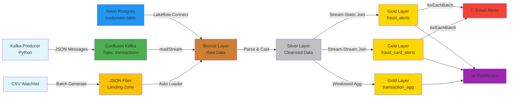

# FinGuard: Real-Time Fraud Detection System


## 📋 Table of Contents
- [Overview](#overview)
- [Architecture](#architecture)
- [Data Flow Examples](#data-flow-examples)
- [Project Structure](#project-structure)
- [Prerequisites](#prerequisites)
- [Setup Instructions](#setup-instructions)
- [Data Sources](#data-sources)
- [Pipeline Details](#pipeline-details)
- [Fraud Detection Logic](#fraud-detection-logic)
- [Email Alerting](#email-alerting)
- [Running the Project](#running-the-project)
- [Monitoring & Dashboards](#monitoring--dashboards)

---

## 🎯 Overview

**FinGuard** is an end-to-end real-time fraud detection system built on **Databricks Free Edition** using streaming data architecture. The project demonstrates production-grade data engineering practices including:

- **Real-time streaming ingestion** from Confluent Kafka and file streams
- **Incremental batch processing** from PostgreSQL databases
- **Medallion architecture** (Bronze → Silver → Gold)
- **Lakeflow Spark Declarative Pipelines (SDP)** for orchestration
- **Stream-static and stream-stream joins** for fraud detection
- **Windowed aggregations** for time-series analytics
- **Real-time email alerts** for fraud events
- **Unity Catalog** for data governance

### Key Features
- ✅ Multi-source data ingestion (Kafka, Files, PostgreSQL)
- ✅ Real-time fraud detection with multiple scenarios
- ✅ Automated email notifications for fraud alerts
- ✅ Scalable streaming architecture with checkpointing
- ✅ Data quality checks and schema enforcement
- ✅ Secure credential management with Databricks secrets

---

## 🏗️ Architecture

### High-Level Data Flow



### Detailed Architecture Diagram

```
╔══════════════════════════════════════════════════════════════════════════════╗
║                            DATA SOURCES LAYER                                 ║
╚══════════════════════════════════════════════════════════════════════════════╝

    ┌─────────────────┐         ┌─────────────────┐         ┌─────────────────┐
    │  Kafka Producer │         │  JSON Files     │         │  Postgres DB    │
    │                 │         │  (Watchlist)    │         │  (Customers)    │
    │  Python Script  │         │  Landing Zone   │         │  Neon Hosted    │
    │  Transaction    │         │  Volume Path    │         │  Master Data    │
    │  Generator      │         │  Auto-Update    │         │  Incremental    │
    └────────┬────────┘         └────────┬────────┘         └────────┬────────┘
             │                           │                           │
             │ JSON Stream               │ File Arrival              │ CDC/Batch
             │ (Real-time)               │ (Ad-hoc)                  │ (Scheduled)
             ▼                           ▼                           ▼
    ┌─────────────────┐         ┌─────────────────┐         ┌─────────────────┐
    │ Confluent Kafka │         │ UC Volume       │         │ Lakeflow Connect│
    │ Topic: txns     │         │ /fraud_landing  │         │ Pipeline        │
    │ 6 Partitions    │         │ Schema Location │         │ Source: Postgres│
    └────────┬────────┘         └────────┬────────┘         └────────┬────────┘
             │                           │                           │
             └───────────────────────────┴───────────────────────────┘
                                         │
╔══════════════════════════════════════════════════════════════════════════════╗
║                         BRONZE LAYER (Raw Ingestion)                          ║
║                    Lakeflow Spark Declarative Pipelines                       ║
╚══════════════════════════════════════════════════════════════════════════════╝
                                         │
                 ┌───────────────────────┼───────────────────────┐
                 │                       │                       │
                 ▼                       ▼                       ▼
    ┌────────────────────┐  ┌────────────────────┐  ┌────────────────────┐
    │ bronze.            │  │ bronze.            │  │ bronze.            │
    │ transactions_      │  │ fraud_watchlist_   │  │ customers          │
    │ kafka_stream       │  │ stream             │  │                    │
    │                    │  │                    │  │                    │
    │ • Kafka readStream │  │ • cloudFiles format│  │ • Postgres sync    │
    │ • Binary value col │  │ • Schema inference │  │ • Full refresh     │
    │ • Checkpoint mgmt  │  │ • Rescued data     │  │ • Change detection │
    └────────┬───────────┘  └────────┬───────────┘  └────────┬───────────┘
             │                       │                       │
             │ Stream                │ Stream                │ Batch
             │                       │                       │
╔══════════════════════════════════════════════════════════════════════════════╗
║                    SILVER LAYER (Cleansed & Typed)                            ║
║                       Transform & Standardize                                 ║
╚══════════════════════════════════════════════════════════════════════════════╝
             │                       │                       │
             ▼                       ▼                       ▼
    ┌────────────────────┐  ┌────────────────────┐  ┌────────────────────┐
    │ silver.            │  │ silver.            │  │ silver.            │
    │ transactions       │  │ fraud_watchlist    │  │ customers          │
    │                    │  │                    │  │                    │
    │ • Parse JSON       │  │ • Cast types       │  │ • Uppercase names  │
    │ • from_json()      │  │ • Add timestamps   │  │ • Validate limits  │
    │ • Cast DECIMAL     │  │ • Schema evolution │  │ • Email validation │
    │ • to_timestamp()   │  │ • De-duplicate     │  │ • SCD Type 1       │
    └────────┬───────────┘  └────────┬───────────┘  └────────┬───────────┘
             │                       │                       │
             │ Streaming             │ Streaming             │ Static (Batch)
             │                       │                       │
             └───────────┬───────────┴───────────┬───────────┘
                         │                       │
╔══════════════════════════════════════════════════════════════════════════════╗
║                      GOLD LAYER (Business Logic)                              ║
║                 Fraud Detection & Analytics                                   ║
╚══════════════════════════════════════════════════════════════════════════════╝
                         │                       │
                         ▼                       ▼
            ┌─────────────────────┐   ┌─────────────────────┐
            │ gold.fraud_alerts   │   │ gold.fraud_card_    │
            │                     │   │ alerts              │
            │ STREAM-STATIC JOIN  │   │                     │
            │                     │   │ STREAM-STREAM JOIN  │
            │ transactions (S) ⚡ │   │                     │
            │      LEFT JOIN      │   │ transactions (S) ⚡ │
            │ customers (Static)  │   │      INNER JOIN     │
            │                     │   │ watchlist (S) ⚡    │
            │ WHERE:              │   │                     │
            │ amount > limit      │   │ WITH WATERMARKS:    │
            │                     │   │ • 10 min left       │
            │ OUTPUT:             │   │ • 10 min right      │
            │ • Alert details     │   │                     │
            │ • Customer email    │   │ ON: card_number     │
            │ • Excess amount     │   │                     │
            └──────────┬──────────┘   └──────────┬──────────┘
                       │                         │
                       │              ┌──────────────────────┐
                       │              │ gold.transaction_    │
                       │              │ counts_per_minute    │
                       │              │                      │
                       │              │ WINDOWED AGGREGATION │
                       │              │                      │
                       │              │ • window(1 min)      │
                       │              │ • COUNT(*), SUM()    │
                       │              │ • GROUP BY window    │
                       │              │                      │
                       │              │ OUTPUT:              │
                       │              │ • Txn velocity       │
                       │              │ • Volume metrics     │
                       │              └──────────┬───────────┘
                       │                         │
╔══════════════════════════════════════════════════════════════════════════════╗
║                      ACTION LAYER (Alerts & Viz)                              ║
╚══════════════════════════════════════════════════════════════════════════════╝
                       │                         │
                       └─────────────┬───────────┘
                                     │
                    ┌────────────────┼────────────────┐
                    │                │                │
                    ▼                ▼                ▼
        ┌───────────────────┐  ┌──────────┐  ┌──────────────┐
        │  Email Alerting   │  │ Dashboard│  │ Job Scheduler│
        │                   │  │          │  │              │
        │  forEachBatch()   │  │ Lakeview │  │ Orchestration│
        │  • SMTP Gmail     │  │ Widgets: │  │              │
        │  • HTML Templates │  │ • Counter│  │ • Daily run  │
        │  • Batch process  │  │ • Chart  │  │ • Error logs │
        │  • Error handling │  │ • Table  │  │ • Monitoring │
        │                   │  │ • Gauge  │  │              │
        └───────────────────┘  └──────────┘  └──────────────┘
```

### Technology Stack

| Layer | Technology | Purpose |
|-------|------------|---------|
| **Ingestion** | Confluent Kafka | Real-time transaction streaming |
| **Ingestion** | Auto Loader (cloudFiles) | Incremental file processing |
| **Ingestion** | Lakeflow Connect | PostgreSQL CDC/batch sync |
| **Storage** | Delta Lake | ACID transactions, time travel |
| **Catalog** | Unity Catalog | Data governance & lineage |
| **Orchestration** | Lakeflow SDP | Declarative pipeline framework |
| **Compute** | Databricks Serverless | Auto-scaling compute |
| **Alerting** | Python SMTP | Email notifications |
| **Visualization** | Lakeview Dashboards | Real-time monitoring |

### Medallion Architecture

**Bronze (Raw Data):**
- `bronze.transactions_kafka_stream` - Raw Kafka transaction events
- `bronze.fraud_watchlist_stream` - Raw watchlist updates from files
- `bronze.customers` - Raw customer data from PostgreSQL

**Silver (Cleansed Data):**
- `silver.transactions` - Parsed and typed transaction records
- `silver.fraud_watchlist` - Standardized watchlist with timestamps
- `silver.customers` - Cleaned customer master data

**Gold (Business Logic):**
- `gold.fraud_alerts` - Stream-static join (transactions + customer limits)
- `gold.fraud_card_alerts` - Stream-stream join (transactions + watchlist)
- `gold.transaction_counts_per_minute` - Windowed aggregations

---

## 📊 Data Flow Examples

### Example 1: Transaction Over Limit Detection

**Scenario:** Customer with $5000 limit makes a $6000 transaction

```
1. KAFKA PRODUCER (Python)
   {
     "transaction_id": "TXN001",
     "customer_id": "CUST123",
     "amount": 6000,
     "merchant": "Electronics Store",
     "timestamp": "2024-01-15 14:30:00"
   }

2. BRONZE INGESTION (Kafka readStream)
   - Raw JSON stored as binary in Delta table
   - Checkpoint: /Volumes/fine_guard/default/checkpoints/kafka_bronze

3. SILVER TRANSFORMATION
   - Parse JSON: from_json(cast(value as string), schema)
   - Cast types: amount → DECIMAL(10,2), timestamp → TIMESTAMP
   - Output: silver.transactions

4. POSTGRES LOOKUP (Static Data)
   silver.customers:
   | customer_id | transaction_limit | email              |
   |-------------|-------------------|--------------------|  
   | CUST123     | 5000              | john@example.com   |

5. GOLD FRAUD DETECTION (Stream-Static Join)
   SELECT 
     t.transaction_id,
     t.customer_id,
     t.amount,
     c.transaction_limit,
     c.email
   FROM silver.transactions t
   LEFT JOIN silver.customers c ON t.customer_id = c.customer_id
   WHERE t.amount > c.transaction_limit

6. EMAIL ALERT TRIGGERED
   To: john@example.com
   Subject: Fraud Alert: Transaction Exceeds Limit
   Body: 
     Transaction TXN001 for $6000 exceeds your limit of $5000
     Merchant: Electronics Store
     Time: 2024-01-15 14:30:00
```

### Example 2: Watchlist Card Detection

**Scenario:** Transaction from a card flagged on fraud watchlist

```
1. FILE STREAM (JSON Landing Zone)
   /Volumes/fine_guard/default/fraud_landing_data/fraud_1.json:
   {
     "card_number": "4532123456789012",
     "reason": "Stolen Card",
     "reported_date": "2024-01-14"
   }

2. AUTO LOADER INGESTION (cloudFiles)
   - Schema inference: cloudFiles.schemaLocation
   - Rescued data column for schema evolution
   - Checkpoint: /Volumes/fine_guard/default/checkpoints/watchlist_bronze

3. KAFKA TRANSACTION (Same Time)
   {
     "transaction_id": "TXN002",
     "card_number": "4532123456789012",
     "amount": 1500,
     "merchant": "Gas Station",
     "transaction_time": "2024-01-15 14:35:00"
   }

4. STREAM-STREAM JOIN (with Watermarks)
   - Left stream: silver.transactions (watermark 10 minutes)
   - Right stream: silver.fraud_watchlist (watermark 10 minutes)
   - Join condition: t.card_number = w.card_number
   - Time constraint: t.transaction_time within watermark bounds

5. GOLD FRAUD CARD ALERTS
   | transaction_id | card_number        | amount | reason       | alert_time        |
   |----------------|--------------------|--------|--------------|-------------------|
   | TXN002         | 4532123456789012   | 1500   | Stolen Card  | 2024-01-15 14:35  |

6. EMAIL ALERT TRIGGERED
   Subject: FRAUD ALERT: Watchlist Card Used
   Body:
     Card 4532...9012 is on fraud watchlist (Stolen Card)
     Transaction TXN002 for $1500 at Gas Station
     Time: 2024-01-15 14:35:00
```

### Example 3: Windowed Aggregations

**Scenario:** Count transactions per minute for monitoring

```
1. STREAMING TRANSACTIONS (Every few seconds)
   14:30:05 → TXN001, $6000
   14:30:15 → TXN002, $1500
   14:30:45 → TXN003, $3200
   14:31:10 → TXN004, $800

2. TUMBLING WINDOW (1-minute window)
   SELECT 
     window(transaction_time, '1 minute') as time_window,
     COUNT(*) as transaction_count,
     SUM(amount) as total_amount
   FROM silver.transactions
   GROUP BY window(transaction_time, '1 minute')

3. AGGREGATED OUTPUT (gold.transaction_counts_per_minute)
   | window_start      | window_end        | transaction_count | total_amount |
   |-------------------|-------------------|-------------------|--------------|  
   | 2024-01-15 14:30  | 2024-01-15 14:31  | 3                 | 10700        |
   | 2024-01-15 14:31  | 2024-01-15 14:32  | 1                 | 800          |

4. DASHBOARD VISUALIZATION
   - Real-time line chart showing transaction velocity
   - Alert if transaction_count > threshold (e.g., 100/min)
```

---

## 📁 Project Structure

```
finguard_project/
├── fraud_detection/
│   ├── README.md                          # This file
│   ├── config/
│   │   ├── kafka_config.json              # Kafka connection details
│   │   └── .env                           # Environment variables (not in Git)
│   ├── producers/
│   │   └── kafka_producer.py              # Python Kafka transaction generator
│   ├── notebooks/
│   │   ├── fraud_watchlist_data_generator # Generate JSON watchlist files
│   │   └── kafka_consumer_test            # Test Kafka connectivity
│   ├── pipelines/
│   │   ├── bronze/
│   │   │   ├── ingest_kafka_transactions  # Kafka → Bronze streaming
│   │   │   ├── ingest_watchlist_files     # Auto Loader → Bronze
│   │   │   └── ingest_customers           # Lakeflow Connect (Postgres)
│   │   ├── silver/
│   │   │   ├── transform_transactions     # Bronze → Silver (parse JSON)
│   │   │   ├── transform_watchlist        # Bronze → Silver (cast types)
│   │   │   └── transform_customers        # Bronze → Silver (uppercase)
│   │   ├── gold/
│   │   │   ├── fraud_alerts               # Stream-static join
│   │   │   ├── fraud_card_alerts          # Stream-stream join
│   │   │   └── transaction_agg            # Windowed aggregations
│   │   └── alerts/
│   │       ├── send_fraud_alert_email     # Email for fraud_alerts
│   │       └── send_card_alert_email      # Email for card alerts
│   ├── data/
│   │   └── fraud_watchlist.csv            # Source watchlist data
│   └── volumes/
│       ├── checkpoints/                   # Streaming checkpoints
│       └── fraud_landing_data/            # JSON file landing zone
```

---

## 🔧 Prerequisites

### 1. Databricks Workspace
- **Free Edition** (or Standard/Premium)
- Unity Catalog enabled
- Serverless compute available

### 2. Confluent Kafka (Free Trial)
- Kafka cluster created
- Topic: `transactions` (6 partitions recommended)
- API Key and Secret generated
- Bootstrap server endpoint noted

### 3. Neon PostgreSQL (Free Tier)
- Database created
- `customers` table populated:
  ```sql
  CREATE TABLE customers (
    customer_id VARCHAR(50) PRIMARY KEY,
    transaction_limit DECIMAL(10,2),
    email VARCHAR(100)
  );
  ```

### 4. Gmail SMTP (for Alerts)
- Gmail account
- App Password generated (Google Account → Security → 2FA → App Passwords)

### 5. Python Environment (for Producer)
- Python 3.8+
- Libraries: `confluent-kafka`, `python-dotenv`, `faker`
  ```bash
  pip install confluent-kafka python-dotenv faker
  ```

---

## ⚙️ Setup Instructions

### Step 1: Clone/Setup Workspace

1. Create workspace folder structure:
   ```python
   dbutils.fs.mkdirs("/Users/your-email@domain.com/finguard_project/fraud_detection")
   ```

2. Create Unity Catalog assets:
   ```sql
   -- Create catalog
   CREATE CATALOG IF NOT EXISTS fine_guard;
   
   -- Create schemas
   CREATE SCHEMA IF NOT EXISTS fine_guard.bronze;
   CREATE SCHEMA IF NOT EXISTS fine_guard.silver;
   CREATE SCHEMA IF NOT EXISTS fine_guard.gold;
   
   -- Create managed volume for checkpoints
   CREATE VOLUME IF NOT EXISTS fine_guard.default.checkpoints;
   CREATE VOLUME IF NOT EXISTS fine_guard.default.fraud_landing_data;
   ```

### Step 2: Configure Secrets

1. Create secret scope (via Databricks REST API or CLI):
   ```bash
   databricks secrets create-scope --scope fraud_detection_secrets
   ```

2. Store Kafka configuration:
   ```python
   import json
   kafka_config = {
     "bootstrap_servers": "pkc-xxx.region.aws.confluent.cloud:9092",
     "topic": "transactions",
     "sasl_username": "YOUR_API_KEY",
     "sasl_password": "YOUR_API_SECRET"
   }
   dbutils.secrets.put(scope="fraud_detection_secrets", 
                       key="kafka_config", 
                       value=json.dumps(kafka_config))
   ```

3. Store email credentials:
   ```python
   dbutils.secrets.put(scope="fraud_detection_secrets", 
                       key="gmail_password", 
                       value="your-app-password")
   ```

### Step 3: Setup Kafka Producer

1. Create `.env` file (local machine):
   ```env
   KAFKA_BOOTSTRAP_SERVERS=pkc-xxx.region.aws.confluent.cloud:9092
   KAFKA_SASL_USERNAME=YOUR_API_KEY
   KAFKA_SASL_PASSWORD=YOUR_API_SECRET
   KAFKA_TOPIC=transactions
   ```

2. Run producer:
   ```bash
   python producers/kafka_producer.py
   ```

### Step 4: Setup Lakeflow Connect (Postgres)

1. Create Lakeflow Connect pipeline:
   - Source: PostgreSQL (Neon)
   - Connection: Host, database, username, password
   - Tables: Select `customers`
   - Destination: `fine_guard.bronze.customers`
   - Mode: Incremental (detect changes)

### Step 5: Deploy Lakeflow SDP Pipelines

1. Create pipeline in Databricks UI:
   - Name: `FinGuard Fraud Detection Pipeline`
   - Source code: Select `pipelines/` folder
   - Catalog: `fine_guard`
   - Target: All schemas (bronze, silver, gold)

2. Start pipeline in Development mode for testing

3. Transition to Production mode when stable

---

## 📡 Data Sources

### 1. Kafka Transactions Stream

**Source:** Confluent Kafka topic `transactions`  
**Format:** JSON messages  
**Frequency:** Real-time (every 5-10 seconds)  
**Schema:**
```json
{
  "transaction_id": "string",
  "customer_id": "string",
  "card_number": "string",
  "amount": "number",
  "merchant": "string",
  "merchant_category": "string",
  "transaction_time": "string (ISO timestamp)",
  "location": "string"
}
```

**Sample Data:**
```json
{
  "transaction_id": "TXN789456",
  "customer_id": "CUST001",
  "card_number": "4532123456789012",
  "amount": 4500.75,
  "merchant": "Best Electronics",
  "merchant_category": "Electronics",
  "transaction_time": "2024-01-15T14:30:00",
  "location": "New York, NY"
}
```

### 2. Fraud Watchlist File Stream

**Source:** JSON files landing in volume  
**Location:** `/Volumes/fine_guard/default/fraud_landing_data/`  
**Format:** JSON files (one record per file)  
**Frequency:** Ad-hoc (as watchlist updates arrive)  
**Schema:**
```json
{
  "card_number": "string",
  "reason": "string",
  "reported_date": "string"
}
```

**Sample Data:**
```json
{
  "card_number": "4532987654321098",
  "reason": "Stolen Card - Reported by Bank",
  "reported_date": "2024-01-14"
}
```

### 3. Customer Master Data (PostgreSQL)

**Source:** Neon PostgreSQL database  
**Table:** `customers`  
**Sync:** Incremental (Lakeflow Connect)  
**Schema:**
```sql
CREATE TABLE customers (
  customer_id VARCHAR(50) PRIMARY KEY,
  first_name VARCHAR(50),
  last_name VARCHAR(50),
  transaction_limit DECIMAL(10,2),
  email VARCHAR(100),
  phone VARCHAR(20),
  created_date DATE
);
```

**Sample Data:**
```
| customer_id | first_name | last_name | transaction_limit | email              |
|-------------|------------|-----------|-------------------|--------------------|  
| CUST001     | John       | Smith     | 5000.00           | john@example.com   |
| CUST002     | Jane       | Doe       | 10000.00          | jane@example.com   |
```

---

## 🔄 Pipeline Details

### Bronze Layer Pipelines

#### 1. Kafka Transactions Ingestion
**File:** `pipelines/bronze/ingest_kafka_transactions.py`

```python
import dlt
from pyspark.sql import functions as F

@dlt.table(
    name="transactions_kafka_stream",
    comment="Raw Kafka transaction stream"
)
def kafka_bronze():
    kafka_config = get_kafka_config()  # From secrets
    
    return (
        spark.readStream
        .format("kafka")
        .option("kafka.bootstrap.servers", kafka_config["bootstrap_servers"])
        .option("subscribe", kafka_config["topic"])
        .option("kafka.sasl.mechanism", "PLAIN")
        .option("kafka.security.protocol", "SASL_SSL")
        .option("kafka.sasl.jaas.config", f"...")
        .option("startingOffsets", "earliest")
        .load()
        .withColumn("ingestion_timestamp", F.current_timestamp())
    )
```

**Checkpoint:** `/Volumes/fine_guard/default/checkpoints/kafka_bronze`  
**Trigger:** Continuous (micro-batch every 10 seconds)

#### 2. Watchlist File Ingestion (Auto Loader)
**File:** `pipelines/bronze/ingest_watchlist_files.py`

```python
@dlt.table(
    name="fraud_watchlist_stream",
    comment="Raw fraud watchlist from JSON files"
)
def watchlist_bronze():
    return (
        spark.readStream
        .format("cloudFiles")
        .option("cloudFiles.format", "json")
        .option("cloudFiles.schemaLocation", 
                "/Volumes/fine_guard/default/checkpoints/watchlist_schema")
        .load("/Volumes/fine_guard/default/fraud_landing_data/")
        .withColumn("file_ingestion_time", F.current_timestamp())
    )
```

**Checkpoint:** Managed by Auto Loader  
**Trigger:** File arrival (schema evolution supported)

### Silver Layer Pipelines

#### 1. Transaction Transformation
**File:** `pipelines/silver/transform_transactions.py`

```python
@dlt.table(
    name="transactions",
    comment="Cleansed and typed transactions"
)
def transactions_silver():
    schema = StructType([
        StructField("transaction_id", StringType()),
        StructField("customer_id", StringType()),
        StructField("card_number", StringType()),
        StructField("amount", DecimalType(10, 2)),
        StructField("merchant", StringType()),
        StructField("transaction_time", StringType())
    ])
    
    return (
        dlt.read_stream("transactions_kafka_stream")
        .select(
            F.from_json(F.col("value").cast("string"), schema).alias("data")
        )
        .select("data.*")
        .withColumn("transaction_time", 
                    F.to_timestamp("transaction_time", "yyyy-MM-dd HH:mm:ss"))
    )
```

### Gold Layer Pipelines

#### 1. Fraud Alerts (Stream-Static Join)
**File:** `pipelines/gold/fraud_alerts.py`

```python
@dlt.table(
    name="fraud_alerts",
    comment="Transactions exceeding customer limits"
)
def fraud_alerts():
    transactions = dlt.read_stream("transactions").alias("t")
    customers = spark.read.table("fine_guard.silver.customers").alias("c")
    
    return (
        transactions
        .join(customers, F.col("t.customer_id") == F.col("c.customer_id"), "left")
        .where(F.col("t.amount") > F.col("c.transaction_limit"))
        .select(
            F.col("t.transaction_id"),
            F.col("t.customer_id"),
            F.col("t.amount"),
            F.col("c.transaction_limit"),
            F.col("c.email"),
            F.col("t.merchant"),
            F.col("t.transaction_time"),
            F.current_timestamp().alias("alert_time")
        )
    )
```

#### 2. Fraud Card Alerts (Stream-Stream Join)
**File:** `pipelines/gold/fraud_card_alerts.py`

```python
@dlt.table(
    name="fraud_card_alerts",
    comment="Transactions from watchlist cards"
)
def fraud_card_alerts():
    transactions = (
        dlt.read_stream("transactions")
        .withWatermark("transaction_time", "10 minutes")
        .alias("t")
    )
    
    watchlist = (
        dlt.read_stream("fraud_watchlist")
        .withWatermark("watchlist_timestamp", "10 minutes")
        .alias("w")
    )
    
    return (
        transactions
        .join(watchlist, F.col("t.card_number") == F.col("w.card_number"), "inner")
        .select(
            F.col("t.transaction_id"),
            F.col("t.card_number"),
            F.col("t.amount"),
            F.col("t.merchant"),
            F.col("w.reason").alias("fraud_reason"),
            F.col("t.transaction_time"),
            F.current_timestamp().alias("alert_time")
        )
    )
```

---

## 🚨 Fraud Detection Logic

### Scenario 1: Transaction Limit Exceeded

**Rule:** `transaction.amount > customer.transaction_limit`

**Detection Method:** Stream-Static Join
- Stream: Real-time transactions from Kafka
- Static: Customer limits from PostgreSQL
- Join Key: `customer_id`

**Example:**
- Customer CUST001 has limit = $5,000
- Transaction TXN123 amount = $7,500
- **FRAUD DETECTED** → Email sent to customer

### Scenario 2: Watchlist Card Usage

**Rule:** `transaction.card_number IN fraud_watchlist`

**Detection Method:** Stream-Stream Join with Watermarks
- Left Stream: Transactions (watermark: 10 min)
- Right Stream: Fraud watchlist updates (watermark: 10 min)
- Join Key: `card_number`

**Example:**
- Card 4532...9012 added to watchlist at 14:20
- Transaction using same card arrives at 14:25
- **FRAUD DETECTED** within watermark window → Alert triggered

### Scenario 3: High-Velocity Transactions (Future)

**Rule:** `COUNT(transactions) > threshold IN WINDOW('1 minute')`

**Detection Method:** Windowed Aggregation
- Window: Tumbling 1-minute windows
- Threshold: > 100 transactions/minute per customer
- Currently implemented for monitoring (not alerting)

---

## 📧 Email Alerting

### Configuration

**SMTP Server:** smtp.gmail.com:587  
**Authentication:** App Password (stored in Databricks secrets)  
**From Address:** Your Gmail account

### Alert Pipeline Pattern

**File:** `pipelines/alerts/send_fraud_alert_email.py`

```python
import dlt
from pyspark.sql import functions as F
import smtplib
from email.mime.text import MIMEText
from email.mime.multipart import MIMEMultipart

def send_alert_email(batch_df, batch_id):
    """Process each micro-batch and send emails"""
    alerts = batch_df.collect()
    
    for alert in alerts:
        msg = MIMEMultipart()
        msg['From'] = "alerts@finguard.com"
        msg['To'] = alert['email']
        msg['Subject'] = "⚠️ FRAUD ALERT: Transaction Exceeds Limit"
        
        body = f"""
        <html>
        <body>
            <h2 style="color: red;">Fraud Alert Detected</h2>
            <p><strong>Transaction ID:</strong> {alert['transaction_id']}</p>
            <p><strong>Amount:</strong> ${alert['amount']:.2f}</p>
            <p><strong>Your Limit:</strong> ${alert['transaction_limit']:.2f}</p>
            <p><strong>Merchant:</strong> {alert['merchant']}</p>
            <p><strong>Time:</strong> {alert['transaction_time']}</p>
            <hr>
            <p>If you did not authorize this transaction, please contact us immediately.</p>
        </body>
        </html>
        """
        
        msg.attach(MIMEText(body, 'html'))
        
        # Send via SMTP
        with smtplib.SMTP('smtp.gmail.com', 587) as server:
            server.starttls()
            server.login("your-email@gmail.com", get_gmail_password())
            server.send_message(msg)

@dlt.table(
    name="fraud_alert_emails",
    comment="Email delivery log for fraud alerts"
)
def send_alerts():
    return (
        dlt.read_stream("fraud_alerts")
        .writeStream
        .foreachBatch(send_alert_email)
        .option("checkpointLocation", 
                "/Volumes/fine_guard/default/checkpoints/email_alerts")
    )
```

### Email Templates

**Limit Exceeded Alert:**
```
Subject: ⚠️ FRAUD ALERT: Transaction Exceeds Limit

Dear Customer,

A transaction on your account has exceeded your authorized limit:
- Transaction ID: TXN123456
- Amount: $7,500.00
- Your Limit: $5,000.00
- Merchant: Electronics Store
- Time: 2024-01-15 14:30:00

If you did not authorize this transaction, please contact us immediately.
```

**Watchlist Card Alert:**
```
Subject: 🚨 FRAUD ALERT: Watchlist Card Detected

Critical Security Alert

A transaction was attempted using a card flagged on our fraud watchlist:
- Card: ****...9012
- Reason: Stolen Card - Reported by Bank
- Transaction: $1,500.00 at Gas Station
- Time: 2024-01-15 14:35:00

This transaction has been flagged for review.
```

---

## 🚀 Running the Project

### Step 1: Start Data Sources

1. **Start Kafka Producer** (local machine):
   ```bash
   cd producers/
   python kafka_producer.py
   ```
   - Generates random transactions every 5-10 seconds
   - Mix of normal and fraud transactions

2. **Generate Watchlist Files** (Databricks notebook):
   - Run `fraud_watchlist_data_generator` notebook
   - Outputs JSON files to landing zone
   - One file per watchlist entry

3. **Verify Postgres Connection** (Lakeflow Connect):
   - Check pipeline status in Databricks UI
   - Should sync `customers` table incrementally

### Step 2: Deploy Lakeflow SDP Pipeline

1. Navigate to **Workflows → Delta Live Tables**

2. Click **Create Pipeline**:
   - **Name:** FinGuard Fraud Detection
   - **Source Code:** `/Users/your-email/finguard_project/fraud_detection/pipelines`
   - **Catalog:** fine_guard
   - **Target Schemas:** bronze, silver, gold
   - **Cluster Mode:** Serverless (recommended for Free Edition)

3. Click **Start** → Select **Development Mode**

4. Monitor pipeline execution:
   - Bronze tables populate first (raw ingestion)
   - Silver tables transform and cleanse
   - Gold tables apply business logic
   - Alert pipelines trigger emails

### Step 3: Monitor Real-Time Processing

1. **Check Pipeline Graph:**
   - Visual DAG shows data flow
   - Green = healthy, Red = errors
   - Click nodes to see record counts

2. **Query Tables:**
   ```sql
   -- Check bronze ingestion
   SELECT COUNT(*) FROM fine_guard.bronze.transactions_kafka_stream;
   
   -- Check silver transformation
   SELECT * FROM fine_guard.silver.transactions ORDER BY transaction_time DESC LIMIT 10;
   
   -- Check fraud detections
   SELECT * FROM fine_guard.gold.fraud_alerts;
   SELECT * FROM fine_guard.gold.fraud_card_alerts;
   
   -- Check aggregations
   SELECT * FROM fine_guard.gold.transaction_counts_per_minute 
   ORDER BY window.start DESC;
   ```

3. **Verify Email Delivery:**
   - Check inbox for fraud alerts
   - Verify alert contains correct transaction details

### Step 4: Troubleshooting

**Issue:** Pipeline fails at bronze layer  
**Solution:** Check Kafka connectivity, verify secrets configuration

**Issue:** No fraud alerts detected  
**Solution:** 
- Verify customer limits in `silver.customers`
- Check transaction amounts exceed limits
- Query `gold.fraud_alerts` directly

**Issue:** Stream-stream join produces no results  
**Solution:**
- Check watermark settings (may need to increase)
- Verify timestamp columns are properly cast
- Ensure both streams have data within watermark window

**Issue:** Emails not sending  
**Solution:**
- Verify Gmail app password in secrets
- Check SMTP server connectivity
- Review `forEachBatch` function logs

---

## 📈 Monitoring & Dashboards

### Real-Time Monitoring Dashboard

**Dashboard Name:** FinGuard Fraud Monitoring

**Widgets:**

1. **Transaction Volume (Line Chart)**
   - Query: `gold.transaction_counts_per_minute`
   - X-axis: window.start (time)
   - Y-axis: transaction_count
   - Refresh: Every 1 minute

2. **Fraud Alert Count (Counter)**
   - Query: `SELECT COUNT(*) FROM gold.fraud_alerts WHERE DATE(alert_time) = CURRENT_DATE()`
   - Shows daily fraud detection count

3. **Top Fraud Merchants (Bar Chart)**
   - Query:
     ```sql
     SELECT merchant, COUNT(*) as fraud_count
     FROM gold.fraud_alerts
     GROUP BY merchant
     ORDER BY fraud_count DESC
     LIMIT 10
     ```

4. **Watchlist Card Activity (Table)**
   - Query: `SELECT * FROM gold.fraud_card_alerts ORDER BY alert_time DESC LIMIT 20`
   - Real-time table of watchlist detections

5. **Average Transaction Amount (Gauge)**
   - Query: `SELECT AVG(amount) FROM silver.transactions WHERE DATE(transaction_time) = CURRENT_DATE()`

### Key Metrics

- **Throughput:** Transactions processed per second
- **Latency:** Time from Kafka ingestion to gold table (end-to-end)
- **Fraud Detection Rate:** Percentage of transactions flagged
- **Email Delivery Success:** Percentage of alerts successfully sent
- **Pipeline Health:** Bronze/Silver/Gold table freshness

---

## 🎓 Learning Outcomes

This project demonstrates:

1. **Streaming Architecture:**
   - Kafka integration with Databricks
   - Auto Loader for file streams
   - Checkpoint management and fault tolerance

2. **Data Engineering:**
   - Medallion architecture (Bronze → Silver → Gold)
   - Schema evolution and management
   - Incremental batch processing

3. **Stream Processing:**
   - Stream-static joins (dimension enrichment)
   - Stream-stream joins with watermarks
   - Windowed aggregations (tumbling windows)

4. **Lakeflow SDP:**
   - Declarative pipeline definitions
   - Data quality expectations
   - Pipeline orchestration and monitoring

5. **Real-Time Alerting:**
   - `forEachBatch` pattern for side effects
   - SMTP integration
   - HTML email formatting

6. **Security & Governance:**
   - Databricks secret management
   - Unity Catalog for data governance
   - Credential isolation (no hardcoded secrets)

---

## 🔮 Future Enhancements

- [ ] **Advanced Fraud Models:** Integrate ML models (XGBoost, LSTM) for anomaly detection
- [ ] **Geolocation Analysis:** Flag transactions from unusual locations
- [ ] **Velocity Checks:** Alert on multiple transactions in short time window
- [ ] **Slack/Teams Integration:** Send alerts to collaboration platforms
- [ ] **A/B Testing:** Test different fraud detection thresholds
- [ ] **Historical Analysis:** Build dimensional model for fraud analytics
- [ ] **Auto-scaling:** Optimize compute based on throughput
- [ ] **Multi-Region:** Deploy across regions for disaster recovery

---

## 🤝 Contributing

Contributions welcome! Please follow these steps:

1. Fork the repository
2. Create a feature branch (`git checkout -b feature/AmazingFeature`)
3. Commit changes (`git commit -m 'Add AmazingFeature'`)
4. Push to branch (`git push origin feature/AmazingFeature`)
5. Open a Pull Request

---

## 📝 License

This project is licensed under the MIT License.

---

## 📧 Contact

**Project Lead:** Rohit Kumar  
**Role:** Senior Data Engineer

**Certification:** Databricks associate, Databricks professional, Databricks analyst

**LinkedIn:** [https://www.linkedin.com/in/rohit-kumar-663684250/](#)  
**GitHub:** [https://github.com/rohitkumar8873/](#)

---

## 🙏 Acknowledgments

- **Databricks** for Free Edition and excellent documentation
- **Confluent** for Kafka free trial and cloud platform
- **Neon** for serverless Postgres hosting
- **Apache Spark** community for streaming framework

---

**Built with ❤️ using Databricks Free Edition**
